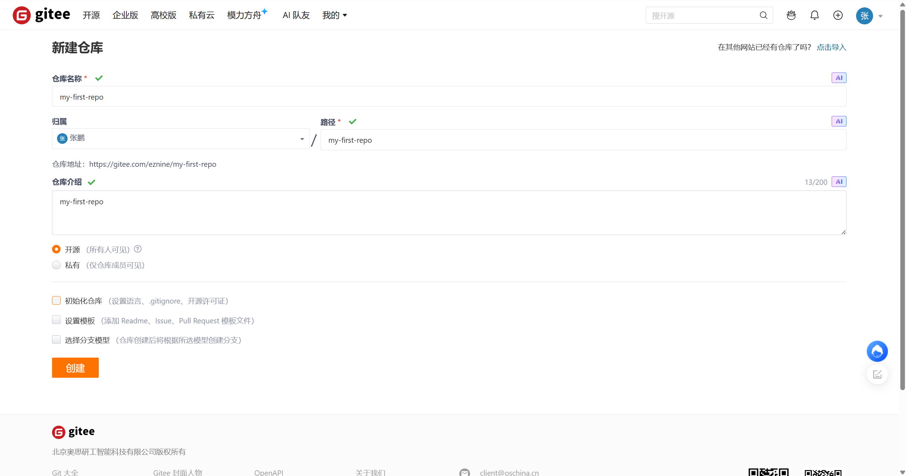
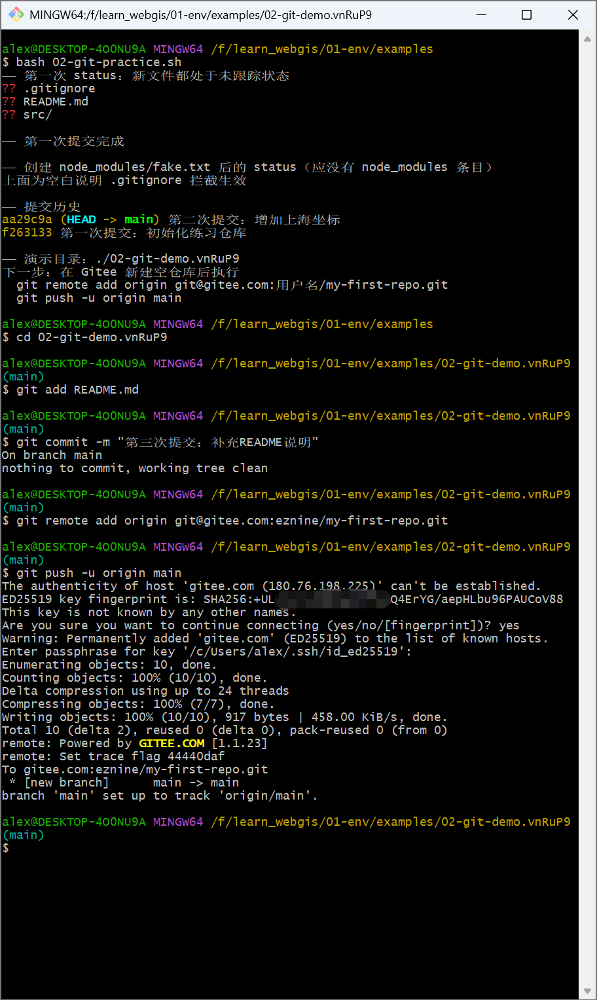
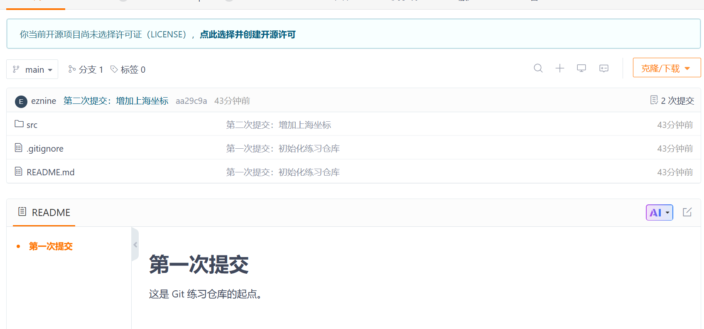

# 第 02 节 · Git 与远程仓库

> 📌 版本信息：基于 Git for Windows **2.55.0**（2026-09-05 核对，官方当前稳定版；本机实装 2.53.0.windows.2，安装方式与命令完全一致）· Git LFS 3.7.1（本机已装，本节不展开）
> 📚 来源：[Git 官网](https://git-scm.com/) ｜ [Git 官方文档](https://git-scm.com/doc) ｜ [GitHub Docs](https://docs.github.com/zh) ｜ [Gitee 帮助中心](https://help.gitee.com/)

## 一、给代码装一个存档点

假设第 01 节已经装好 Node.js，并从 GitHub 拿到了一个 React + Leaflet 项目，开发服务器也跑起来了。

接下来开始给地图加旅行足迹：调整底图样式、添加 Marker、改弹窗文案，又顺手把坐标数据整理成单独的 JS 文件。调了一晚上，终于把页面修到满意状态。第二天再打开项目，想对比昨天“能跑”的那一版，却发现改过的文件已经混在一起，既说不清改了哪里，也退不回昨晚的完整状态。更麻烦的是，一旦发现某一次 AI 给的建议把项目改崩了，手头没有任何存档可以回滚。

这时需要的不只是“再复制一个文件夹”，而是一套能回答三个问题的机制：

- 什么时间点发生过什么改动？
- 每一处改动改了哪些文件、哪些行？
- 能否回到任何一个历史版本，并能把版本同步到另一台电脑？

Git 就是这套机制的答案。后续所有综合项目、地图库源码阅读、AI 协作修改，都会建立在 Git 之上。

## 二、这一节讲什么，学完能做什么

这一节先建立 Git 的“三个区域 + 本地远程”心智模型，再在 Windows 上完成安装与首次配置，最后用一套固定命令走通日常循环：改代码 → `add` → `commit` → `push`，并从远程 `pull` 新内容。

学完本节能做到：

1. 一句话说清 Git 解决什么问题，并画出工作区、暂存区、本地仓库、远程仓库之间的关系
2. 在 Windows 上安装并完成首次全局配置，验证 `git config --global --list`
3. 独立走通“克隆、修改、提交、推送、拉取”五个动作
4. 写出合格的 `.gitignore`，说清 `node_modules/`、`dist/`、`.env` 为什么不能提交
5. 配置 SSH 密钥并推送到 GitHub / Gitee

## 三、核心概念

### 3.1 Git 是什么

Git 是分布式版本控制系统。普通备份保存的是“某一时刻文件的完整拷贝”，Git 保存的是“文件状态随时间形成的一条提交链”。每个提交（commit）都是一次完整的快照，并且知道自己从哪个提交变来。

```text
commit 3（最新）  ←  语义：增加上海坐标
commit 2          ←  语义：增加 Marker 弹窗
commit 1          ←  语义：初始化地图项目
```

在 Git 里，每次提交都有一个全局唯一的哈希值（如 `a3f4c2d`），类似存档的编号。提交之后，这个版本的内容会一直留在历史里，不会因为后面继续修改而消失。

### 3.2 三个区域：工作区、暂存区、本地仓库

理解三个区域，是理解所有 Git 命令的基础：

| 区域                           | 对应位置                     | 作用                           |
| ------------------------------ | ---------------------------- | ------------------------------ |
| 工作区（working tree）         | 项目里看得见、正在编辑的文件 | 日常修改发生的地方             |
| 暂存区（index / staging area） | `.git/` 内部的一块索引       | 挑选“下一次提交要包含哪些改动” |
| 本地仓库（repository）         | `.git/` 目录                 | 保存全部提交历史               |

两个核心动作：

- `git add`：把工作区里指定的改动放进暂存区。相当于告诉 Git“这些内容准备存档”。
- `git commit`：把暂存区内所有内容打包成一次提交，写入本地仓库。相当于正式存档。

`.git` 目录在 `git init` 或 `git clone` 时生成，是 Git 的全部仓库数据所在；普通文件可以放心删改，`.git` 里的历史对象不要手工乱动。

### 3.3 本地仓库与远程仓库

```text
本机                                                    云端
┌──────────────────────────────┐              ┌────────────────┐
│ 工作区                        │              │  GitHub / Gitee │
│   ↓ git add                  │              │  远程仓库       │
│ 暂存区                        │    push      │  (origin)       │
│   ↓ git commit               │ ───────────→ │                │
│ 本地仓库（提交链）              │ ←─────────── │                │
└──────────────────────────────┘    pull      └────────────────┘
```

远程仓库在本机有一个约定俗成的别名 `origin`。`push` 把本地新提交上传，`pull` 把远程新提交下载并合并到当前分支。`clone` 则把远程仓库完整复制到本机，同时保留它的全部历史。

### 3.4 Git 与其他方案的区别

| 方案           | 保存方式             | 问题                                       |
| -------------- | -------------------- | ------------------------------------------ |
| 手动复制文件夹 | 按时间复制整份目录   | 占空间、容易漏、不知道改了什么             |
| 网盘同步       | 覆盖最新状态         | 只有“最新版”，没有历史版本                 |
| SVN（集中式）  | 历史存在中心服务器   | 离线不能提交，仓库坏了历史就全丢           |
| Git（分布式）  | 每台机器都有完整历史 | 前期心智成本稍高，但换来离线提交与完整回滚 |

对 WebGIS 项目来说，还有一层现实原因：Leaflet、OpenLayers、Cesium 这些库的源码都在 GitHub 上，后续“读官方文档像读自己的笔记”、看开源项目怎么写，第一步都是把仓库 `clone` 到本地。Git 不只是备份工具，还是阅读和协作基础设施。

## 四、Windows 安装、首次配置与日常循环

### 4.1 安装 Git for Windows

从 [Git 官网](https://git-scm.com/download/win) 下载 Windows 版安装包。安装向导保持默认即可，重点确认两个选项：

- **Choosing the default editor**：选 `Use Visual Studio Code as Git's default editor`。如果 VS Code 还没装，可先选 Notepad，下一节装完 VS Code 后再改。
- **Adjusting your PATH environment**：保持默认 `Git from the command line and also from 3rd-party software`，这样 PowerShell 和 Git Bash 都能直接使用 `git`。

安装完成后，**必须新开一个终端窗口**再验证，因为环境变量不会立刻注入到旧窗口：

```bash
git --version
```

能输出版本号（如 `git version 2.53.0.windows.2`）即安装成功。

### 4.2 首次全局配置

Git 的每次提交都会记录作者姓名和邮箱，公共仓库里所有人可见。第一次使用前配置一次即可，后续都会自动带上：

```bash
git config --global user.name "名字"
git config --global user.email "邮箱@example.com"
```

Windows 上还推荐顺手做三项配置：

```bash
# 关闭自动换行符转换，避免 LF/CRLF 反复警告（仓库里统一用 LF）
git config --global core.autocrlf false

# 提交信息里的中文文件名不显示成 \346\226\207 这类转义
git config --global core.quotepath false

# 允许处理超长路径（后续项目结构变深时有用）
git config --global core.longpaths true

# 新建仓库默认分支叫 main，与 GitHub/Gitee 新仓库一致
git config --global init.defaultBranch main
```

验证全部配置：

```bash
git config --global --list
```

### 4.3 日常循环：四个命令

日常 90% 的操作集中在四个命令上：

```bash
git status        # 看当前状态：哪些文件改了、哪些还没提交
git add .         # 把所有改动放进暂存区（可改成指定文件）
git commit -m "语义：这次改了什么"   # 正式存档
git push          # 把本地新提交推到远程
```

各命令背后的数据流：

- `git status` 先回答“现在处于什么状态”。看到 `modified` 表示已有改动未暂存，看到 `Untracked files` 表示文件从未被 Git 跟踪。状态不确认就执行下一步，是大多数误操作的开端。
- `git add .` 把当前目录下所有符合条件的新增、修改、删除都收进暂存区。只想提交某一个文件时，写成 `git add src/map.js`。
- `git commit -m "..."` 把暂存区打包成一次提交。`-m` 后面是提交说明，用“动词 + 内容”写清语义，例如 `添加 Marker 弹窗`、`修复坐标系偏移`，而不是 `1`、`改了`、`asdf`。
- `git push` 只上传本地有而远程没有的提交。第一次推送前需要先关联远程仓库，见 4.5。

配合查看的命令：

```bash
git log --oneline          # 一行一条提交历史
git diff                   # 查看工作区里还没有暂存的改动
git diff --cached          # 查看已暂存、还没提交的改动
```

### 4.4 `.gitignore`：什么不该进仓库

项目根目录新建一个 `.gitignore` 文本文件，按模式列出不需要跟踪的文件。一个 Web 前端项目的最小模板：

```gitignore
# 依赖包：体积巨大，且可由 package.json 重新安装
node_modules/

# 构建产物：可由源码重新 build
dist/

# 环境变量：常含密钥
.env
.env.local

# 系统与编辑器垃圾文件
.DS_Store
Thumbs.db
.idea/
```

判断规则只有一句话：**能从源码重新生成的东西，都不进仓库；包含密钥的东西，绝对不能进仓库。** `node_modules/` 不是不应该存在，而是不应该被 Git 跟踪；本地照常使用，仓库里只保存 `package.json` 这份“配方”。

### 4.5 远程仓库：GitHub、Gitee 与 SSH

GitHub 是国际开源项目主阵地，`resources/` 里参考仓库基本都在那里；Gitee 在国内访问更稳、私有仓库免费，适合存放练习项目。两个都注册，后续按场景选择。

推荐用 SSH 连接，免去每次推送输密码，密钥还能单独撤销。生成一次密钥对：

```bash
ssh-keygen -t ed25519 -C "邮箱或备注"
```

一路回车使用默认位置即可。公钥内容查看：

```bash
cat ~/.ssh/id_ed25519.pub
```

把完整公钥复制到平台：

- GitHub：Settings → SSH and GPG keys → New SSH key
- Gitee：设置 → SSH 公钥 → 添加

第一次连接时终端会询问是否信任主机指纹，输入 `yes` 即可。测试：

```bash
ssh -T git@github.com
ssh -T git@gitee.com
```

看到成功认证提示，说明 SSH 已生效。之后克隆仓库或关联远程：

```bash
# 克隆远程完整项目
git clone git@github.com:Leaflet/Leaflet.git

# 本地已有项目，首次关联并推送
git remote add origin git@gitee.com:用户名/my-first-repo.git
git push -u origin main
```

`-u`（即 `--set-upstream`）把当前分支与远程 `main` 建立默认关联，之后直接 `git push`、`git pull` 就能识别目标。

## 五、易错点：为什么错，怎么办

| 现象                                      | 原因                                  | 解决                                                                                                              |
| ----------------------------------------- | ------------------------------------- | ----------------------------------------------------------------------------------------------------------------- |
| `git status` 里出现大量 `node_modules`    | `.gitignore` 写晚了，或文件已被跟踪   | 先`git rm -r --cached node_modules` 解除跟踪（本地文件不删），补进 `.gitignore` 后提交                            |
| `.env` 已经 push 到公开仓库               | 提交前没检查状态                      | 立即在对应平台作废并更换密钥，然后`git rm --cached .env` 解除跟踪并提交；历史里仍可能留存，所以更换密钥才是根本解 |
| `push` 被拒，提示远程有新提交             | 远程分支领先本地分支                  | 先`git pull` 合并，再 `git push`；不要无脑 `git push -f`，强推会覆盖别人（或另一台电脑）的提交                    |
| 旧终端提示`git` 不是命令                  | 安装后环境变量未刷新                  | 关掉旧终端，新开 Git Bash 或 PowerShell                                                                           |
| 提交作者是陌生人/默认值                   | 首次配置遗漏`user.name`、`user.email` | 补配置；若只是最后一次提交且未推送，可`git commit --amend --reset-author`                                         |
| 新建仓库分支是`master`，而平台默认 `main` | Git 默认分支名不同                    | 执行`git branch -M main` 改名后再推送                                                                             |
| 执行`git restore .` 后还原了文件          | 该命令会丢弃工作区未提交改动          | 丢弃前先确认改动内容；“想保留一份再试验”时先`git stash` 或先提交                                                  |

最值得记住的一条心法：**提交前先 `git status`，提交说明写“语义”，回滚前先确认内容。** 这三个习惯能避开大部分新手事故。

## 六、动手练习：跑通第一次提交与推送

配套文件：[02-git-practice.sh](/code/02-git-practice.sh)

### 练习目标

脚本会在运行目录下新建一个临时练习仓库，自动走完“初始化 → 首次提交 → 验证 .gitignore → 第二次提交 → 查看历史”的完整本地循环，最后把仓库路径打印出来，交给手动推送远程。

### 练习步骤

1. 在仓库根目录打开 Git Bash，执行：

```bash
bash 02-git-practice.sh
```

2. 观察输出中的三次关键结果：
   - `git status --short` 第一次列出 3 个未跟踪内容（README、src、.gitignore）
   - 创建 `node_modules/` 后再次 `git status --short` 不再出现它，说明 `.gitignore` 拦截生效
   - `git log --oneline` 显示两次提交，第二次提交信息是 `第二次提交：增加上海坐标`

3. 打开脚本结尾打印的仓库路径，把 `README.md` 改一行，再走一遍：

```bash
cd 刚刚打印的目录
git add README.md
git commit -m "第三次提交：补充 README 说明"
```

4. 在 [Gitee](https://gitee.com/) 新建一个空仓库 `my-first-repo`（不要勾选初始化 README），在本机练习目录执行：

```bash
git remote add origin git@gitee.com:用户名/my-first-repo.git
git push -u origin main
```

### 验收标准







- [ ] 脚本八步输出中没有报错，`git log --oneline` 能看到两次提交
- [ ] `node_modules/` 始终不出现在 `git status` 结果里
- [ ] 在 Gitee 网页能看到 README 内容和提交历史
- [ ] 口头能讲清 `add` 与 `commit` 分别连接哪两个区域

### 脚本里做了什么

脚本主干可以拆成四句话：

- `git init -b main`：在当前目录初始化仓库，并把默认分支设为 `main`
- `cat > 文件 <<'EOF'`：生成示例文件，体验“文件从无到有”的未跟踪状态
- `git add .` + `git commit`：把第一批文件做成第一次提交
- `touch node_modules/fake.txt`：故意制造一个“不该提交”的文件，验证 `.gitignore` 是否真的在工作

练习脚本只负责本地部分。远程推送必须处理平台账号和密钥，所以留在手动步骤，不能也不必做成脚本。

## 七、自测题

1. 工作区、暂存区、本地仓库三个区域之间，`add` 和 `commit` 分别连接哪两段？
2. `node_modules/` 为什么不进仓库？请给出两个理由。
3. `.env` 被提交并 push 到公开仓库后，为什么光删除文件还不够？
4. SSH 方式相比 HTTPS 方式解决了什么问题？
5. `git status` 显示有 3 个文件改动，只想提交其中 1 个，命令怎么写？

### 参考答案

1. `add` 连接工作区 → 暂存区；`commit` 连接暂存区 → 本地仓库。
2. 一是体积巨大，clone、push 都会因此变慢；二是它由 `package.json` 完整可复原，仓库里应只保存“配方”而不是“产物”。
3. 因为提交一旦 push，密钥内容就留在 Git 历史里，普通文件删除不会清除历史快照；必须先在平台上作废/更换该凭据，再解除跟踪并重新提交。
4. 免去每次推送输入账号密码；使用密钥对认证，可单独生成、单独撤销，也能配合平台做更细的权限管理。
5. `git add 该文件名`，然后 `git commit -m "语义"`；不要直接 `git add .`。

## 八、下一步

代码环境（Node/npm）与代码管理（Git）都已就位，下一步把写代码的工具升级成“驾驶舱”状态：**第 03 节 · VS Code 与插件**，把编辑器、终端和 Git 面板放进同一个窗口。
