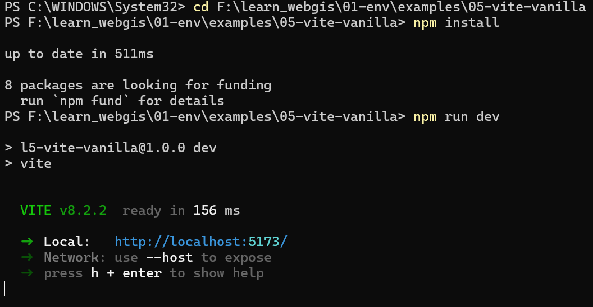

# 第 05 节 · Vite 快速上手

> 📌 版本信息：基于 **Vite 8.2.2**（2026-09-06 核对，Vite 8 起以 Rolldown 为统一打包内核；create-vite 当前 9.2.0）· 本机 Node v24 LTS
> 📚 来源：[Vite 官方中文文档](https://cn.vitejs.dev/guide/) ｜ [Vite 8 发布公告](https://vite.dev/blog/announcing-vite8) ｜ [create-vite](https://www.npmjs.com/package/create-vite)
> 🖥️ 配套练习：[05-vite-vanilla/](/code/05-vite-vanilla-src.zip)（源码包，下载后 `npm install` 即可运行）

## 一、从一张 HTML 到一条流水线

第 04 节的地图页面是单个 HTML 文件：Leaflet 从 `lib/` 引入，脚本写在 `<script>` 里，用 Live Server 或直接双击就能打开。这种形态在小练习里很方便，但项目一旦长大，问题会接连出现：

- 第 04 节的页面想复用底图配置，只能复制粘贴整段脚本
- 地图逻辑、坐标数据、样式混在一个文件里，改一处容易碰坏另一处
- 浏览器不认识 `import './style.css'` 这类现代写法，原生 ES Module 又受协议和路径限制
- 上线前没有人压缩 JS 与 CSS，文件大、请求多，也没有内容指纹解决缓存

换句话说，缺的不是更多“页面”，而是一条把源码加工成可运行页面的流水线：开发时起一个本地服务器，代码改动即时生效；上线前把分散源码合并、压缩、加指纹。Vite 就是这条流水线的入门方案。

## 二、这一节讲什么，学完能做什么

这一节把第一个 Vite 项目跑起来，理解开发服务器、热更新、生产构建三个环节，并读懂 Vanilla 模板里每个文件的分工。

学完本节能做到：

1. 用自己的话说清构建工具解决什么问题，以及没有它时的开发方式哪几处会崩
2. 用 `create-vite` 创建项目，或直接运行配套的 Vanilla 项目
3. 跑通 `npm run dev`、`npm run build`、`npm run preview`
4. 看懂 `index.html`、`src/main.js`、`src/counter.js`、`src/style.css`、`package.json` 各自承担什么
5. 解释 HMR、`dist/`、内容指纹、`type="module"` 这几个关键概念
6. 读懂 Vite 的终端输出，遇到常见报错能定位方向

## 三、核心概念

### 3.1 构建工具：把源码加工成浏览器能高效运行的东西

“构建”（build）可以拆成两层理解：

- **转换**：把 TypeScript、JSX、CSS 等浏览器不能直接吃的源码，翻译成浏览器支持的 JS/CSS
- **打包**：把散落的模块按依赖关系合并成少量文件，压缩体积，自动处理路径

Vite 在开发和生产两种场景下，机制并不相同：

| 场景 | 命令 | 干什么 | 产物 |
|---|---|---|---|
| 开发 | `npm run dev` | 起一个本地 HTTP 服务器，按需转换源码 | 没有持久产物，浏览器直接请求源码模块 |
| 上线 | `npm run build` | 读取入口，递归找到所有依赖，转换、合并、压缩 | `dist/` 里的静态文件 |
| 产物预览 | `npm run preview` | 本地起一个服务器模拟线上环境 | 直接服务 `dist/` |

类比做菜：开发服务器是“现点现做的小灶”，按需加工正在看的那一道；生产构建是“中央厨房批量装盒”，一次做好全部套餐，送到任何档口都能直接卖。

### 3.2 开发服务器为什么必要

Vite 开发服务器至少解决三件事：

1. **ES Module 的协议问题**：`<script type="module">` 在 `file://` 下会被浏览器拦截（CORS 与本地文件限制），通过 `http://localhost:5173` 访问则没有这个问题
2. **裸模块与 CSS 导入**：`import './style.css'` 不是浏览器原生语法，Vite 把它转成可执行的模块请求
3. **按需编译**：浏览器请求哪个模块，Vite 才编译哪个模块，所以启动速度与项目规模关系不大

这也解释了第 04 节练习里的单文件为什么可以双击打开：它用的是普通 `<script>`，没有 ES Module，也没有 `import`。进入工程化写法后，统一从开发服务器访问。

### 3.3 HMR：只换改动的模块

HMR（Hot Module Replacement，模块热替换）是开发服务器的核心体验：保存文件后，浏览器不整页刷新，只重新执行受影响的模块。

以计数器为例：

- 只改 `style.css` 的颜色：样式直接替换，计数状态保留
- 改 `counter.js` 的渲染逻辑：该模块被重新执行，按钮重新装配，计数可能归零
- 改 `index.html`：结构变了，浏览器通常会整页刷新

所以“HMR 保留状态”不等于“所有状态都保留”，而是“谁被改就换谁”。对地图应用的意义在于：改图层逻辑时，地图实例、缩放级别等不受影响模块里的状态通常还在，不用每次调试都重新拖回原来的视野。

### 3.4 Vite、webpack、Rollup 等工具的关系

| 工具 | 定位 | 特点 |
|---|---|---|
| Vite | 开发服务器 + 构建工具 | 开发体验好，配置少，生态现代，当前默认新项目方案 |
| webpack | 通用模块打包器 | 生态庞大、可配置性极强，但配置和构建速度的代价也高 |
| Rollup / Rolldown | 库与应用的打包内核 | Vite 生产构建底层就是打包内核，Vite 8 起默认 Rolldown |
| esbuild | 极速转译器 | 速度快，常被其他工具当作底层能力 |

学习阶段不追各家配置，先把 Vite 这一条链路用熟；以后读复杂仓库时，看到的 `webpack.config.js` 能认出同类工具就够了。

## 四、创建并跑起第一个项目

### 4.1 用 create-vite 生成项目

`create-vite` 是 Vite 官方的脚手架，作用是根据模板生成一个最小项目骨架。创建命令：

```bash
npm create vite@latest 05-vite-vanilla -- --template vanilla
```

`npm create vite@latest` 会临时执行最新版 create-vite；`--template vanilla` 跳过交互选择，直接生成 Vanilla + JavaScript 模板。如果不加模板参数，向导会依次询问框架和语言，选 **Vanilla** 与 **JavaScript** 即可。

注意：源码包里已经放好同款项目（`05-vite-vanilla/`），第一次先直接用这份，想亲手跑脚手架时在别的目录执行，避免同名目录冲突。

> 💡 脚手架生成的文件来自官方模板，没有魔法：一份 `package.json`、一个入口 HTML、几个源码文件。能拆开讲清楚每一份是什么，才算真正用上了它。

### 4.2 安装与启动开发服务器

```bash
cd 05-vite-vanilla
npm install
npm run	 dev
```

`npm install` 按 `package.json` 只安装一个开发依赖 `vite`，很快完成。`npm run dev` 启动后的终端输出类似：

```text
VITE v8.2.2  ready in 312 ms

➜  Local:   http://localhost:5173/
➜  Network: use --host to expose
```



第一行是“服务器就绪”的版本与耗时；`Local` 是本机访问地址，浏览器打开即可看到计数器页面。`Network` 提示需要让局域网其他设备访问时加 `--host`，学习阶段不用。

> ⚠️ 如果直接双击项目里的 `index.html`，多半会白屏；这不是代码坏了，而是 ES Module 必须经 HTTP 服务器加载，回到 `npm run dev` 的地址再访问即可。

打开页面后回到 Network 面板，会看到 `/`、`/src/main.js`、`/src/counter.js` 等请求，与第 04 节“网页是请求集合”的观察方式一致：开发模式下浏览器请求的是源码模块，而不是 `dist` 里的压缩文件。

### 4.3 项目文件说明

```text
05-vite-vanilla/
├── index.html          入口页面，脚本从这里指向 src/main.js
├── package.json        依赖与命令账本
├── package-lock.json   精确锁定每个依赖版本
└── src/
    ├── main.js         JS 入口：导入样式、装配计数器
    ├── counter.js      计数器模块：独立管理一个功能
    └── style.css       被 main.js import 的全局样式
```

`index.html` 在项目根目录，这是 Vite 的约定：它本身不是构建入口，但 `main.js` 的依赖图从它开始。关键一行：

```html
<script type="module" src="/src/main.js"></script>
```

`type="module"` 告诉浏览器这是一个 ES Module 脚本；`/src/main.js` 是根路径写法，由 Vite 开发服务器解析。生产构建时，Vite 会把这个入口替换成带指纹的产物脚本。

### 4.4 读懂 main.js 与 counter.js

`src/main.js`：

```js
import './style.css';
import { setupCounter } from './counter.js';

const counterEl = document.querySelector('#counter');
setupCounter(counterEl);
```

第一行导入 CSS，原生浏览器不认识这种写法，Vite 会把它转成可执行模块；第二行从 `counter.js` 导入 `setupCounter` 函数，`./` 表示同目录；接下来找到页面里的 `#counter` 按钮，把计数器逻辑装配上去。数据流是：`index.html` → `main.js` → `counter.js`，再到 DOM。

`src/counter.js`：

```js
export function setupCounter(button) {
  let count = 0;

  const render = () => {
    button.innerHTML = `点了 ${count}`;
  };

  button.addEventListener('click', () => {
    count += 1;
    render();
  });

  render();
}
```

`count` 是模块函数内的闭包变量，点击事件每次执行时都能读到并修改它；`render` 把最新数值写进按钮文本；最后调用一次 `render()`，让按钮初始就显示 `0`。这个文件独立成模块的价值是：同一个函数可以装到任意按钮上，不同按钮有各自的计数，互不干扰。

### 4.5 HMR 实验

保持 dev 服务器运行，做两个小改动：

1. 把 `counter.js` 里的 `点了 ${count}` 改成 `点击 ${count}`，保存，观察浏览器文字变化与终端里的 `hmr update` 提示
2. 把 `style.css` 里的 `background: #1a1a2e` 改成其他颜色，保存，观察底色变化

这两步都不需要手动刷新。若再点几下计数器再改样式，会发现计数保留，这就是“模块级替换”的直观效果。

> 💡 HMR 看到的状态差异也是线索：改 CSS 保留计数、改 `counter.js` 会重新装配按钮，正说明“谁被改，谁才被替换”。

### 4.6 生产构建与预览

停止 dev 服务器（终端按 `Ctrl+C`），执行：

```bash
npm run build
```

本机当前项目的真实输出：

```text
vite v8.2.2 building client environment for production...
✓ 6 modules transformed.
dist/index.html                 1.03 kB │ gzip: 0.75 kB
dist/assets/index-owgvDRbc.css  0.34 kB │ gzip: 0.25 kB
dist/assets/index-Bts5PkZ_.js   0.81 kB │ gzip: 0.47 kB
✓ built in 242ms
```

三个关键观察：

1. **产物在 `dist/`**：这是上线时唯一要交给服务器的目录
2. **文件名带指纹**：`index-Bts5PkZ_.js`、`index-owgvDRbc.css` 里的字符串是内容哈希，内容一变文件名就变，浏览器缓存自动失效
3. **gzip 是压缩后大小**：服务器开启 gzip 传输时实际网络体积约等于这一列，Nginx 部署时会再回来讲

构建完成后预览产物：

```bash
npm run preview
```

终端给出 `http://localhost:4173/`，用浏览器打开，功能与 dev 页面一致，但 Network 面板里请求的是 `dist/assets/` 下的压缩文件。preview 只用于本地确认“上线形态”，不是线上服务器。

## 五、易错点：为什么错，怎么办

| 现象 | 原因 | 解决 |
|---|---|---|
| 直接双击 `index.html` 打开，页面白屏 | ESM 与 CSS 导入依赖 Vite 服务器翻译，`file://` 协议下被浏览器限制 | 始终通过 `npm run dev` 访问；静态单页练习才用双击 |
| 终端提示找不到 `vite` 命令 | 依赖没装 | 先 `npm install`，再 `npm run dev` |
| 端口被占 | 5173 被其他进程使用 | Vite 通常自动换到 5174；也可在配置中固定端口 |
| 改了代码没变化 | dev 服务器未运行，或保存的是别的文件 | 确认运行的是 `npm run dev`，检查文件路径 |
| 改 `vite.config.js` 不生效 | 配置文件变更需要重启 | `Ctrl+C` 后重新 `npm run dev` |
| import 路径报错 | 路径写错、文件名大小写不一致 | 检查 `./`、`../` 与大小写；Windows 不区分大小写但 Linux/部署环境区分 |
| 项目路径含中文或空格 | 部分工具链对路径处理不稳定 | 项目保持英文、无空格路径，`F:\learn_webgis` 就是标准例子 |
| 把 `node_modules` 提交进 Git | 没写 `.gitignore` | 参照第 02 节把 `node_modules/`、`dist/` 加入忽略清单 |

## 六、动手练习：把 05-vite-vanilla 跑起来

配套目录：[05-vite-vanilla/](/code/05-vite-vanilla-src.zip)（项目已生成好，需要执行 install）

### 练习目标

完整走一遍 Vite 的开发闭环：安装依赖 → dev → HMR → build → preview，并保证能逐句讲出 `main.js` 与 `counter.js` 做了什么。

### 练习步骤

1. 打开 VS Code，用 File → Open Folder 打开解压后的 `05-vite-vanilla` 文件夹。
2. 执行 `npm install`，观察 `node_modules/` 出现，`package-lock.json` 更新。
3. 执行 `npm run dev`，按 `Ctrl` 单击终端里的 Local 地址，在浏览器打开页面。
4. 打开 DevTools → Network，刷新页面，确认请求以 `/src/main.js`、`/src/counter.js` 等源码模块为主。
5. 完成 4.5 的 HMR 实验，改完不刷新也能看到效果。
6. 把 `counter.js` 从“点了”改成“点击”后，保存；若想恢复，改回原文即可。
7. 终端 `Ctrl+C` 停止 dev，执行 `npm run build`，进入 `dist/` 对照文档里的产物结构。
8. 执行 `npm run preview`，用浏览器访问 4173 端口，确认产物页面也能运行。

### 主要代码逐段看

`package.json` 的 `scripts`：

```json
{
  "scripts": {
    "dev": "vite",
    "build": "vite build",
    "preview": "vite preview"
  },
  "devDependencies": {
    "vite": "^8.2.2"
  }
}
```

每一条 `npm run` 都对应这里的一行命令，`vite` 是开发服务器，`vite build` 是生产构建，`vite preview` 是产物预览。`vite` 放在 `devDependencies` 而不是 `dependencies`：运行时不需要它，只有开发与构建时需要；第 01 节讲过两者的区别。

`index.html` 里的模块脚本与 `main.js` 的配合，是整个项目的入口链路：

```text
HTML <script type="module" src="/src/main.js">
  → main.js import './style.css' + setupCounter
  → counter.js 维护点击计数并渲染按钮
  → 浏览器页面看到最终效果
```

这就是工程化项目与单文件页面最大的差异：代码按职责拆开，依赖关系由 `import` 显式表达，构建工具负责把它们重新组装。

### 为什么练习用 Vanilla 而不是 React

本节目标是在最小项目里理解构建工具本身，还没有到组件化。Vanilla 模板只有三个源文件，`import`、模块拆分、HMR、构建产物都看得见。直接上 React 会让“构建工具”和“框架”两个概念混在一起，反而不好判断哪个环节报了错。React 在后续模块出现时，这套 Vite 认知会原样适用。

### 验收标准

- [ ] `npm run dev` 成功启动，浏览器能看到计数器页面
- [ ] 改文案后不刷新页面，内容即时更新，终端出现 `hmr update`
- [ ] 能用一句话说出 dev 与 build 的区别
- [ ] `npm run build` 后在 `dist/` 找到带指纹的 JS 与 CSS
- [ ] 能逐行解释 `main.js`：每个 `import`、每个变量、每次函数调用各做什么
- [ ] 能解释为什么这个项目需要 `npm install`，而第 01 节的检查脚本不需要

### 可以自己试的修改

改 `counter.js` 里 `let count = 0` 为 `let count = 3`，观察初始显示变成 3；把按钮文字换一个词；把 `style.css` 的暗色背景换成自己喜欢的颜色。每次只改一处，观察 HMR 的效果。没有强制的新增功能任务，本节核心是跑通并读懂流水线。

## 七、自测题

1. `npm run dev` 与 `npm run build` 分别在干什么？产出的东西各在哪里？
2. HMR 与“整页刷新”的区别是什么？对地图应用为什么有价值？
3. 为什么 `index.html` 里 `<script type="module" src="/src/main.js">` 双击打开会失败，而通过 Vite 服务器访问就能成功？
4. `dist/assets/index-Bts5PkZ_.js` 里的 `Bts5PkZ_` 是什么？它解决了什么问题？
5. `npm create vite@latest` 里 `@latest` 是什么意思？`--template vanilla` 起什么作用？

### 参考答案

1. dev 启动开发服务器，按需转换源码，通过浏览器请求访问；build 把整个依赖图打包压缩到 `dist/`，产物用于上线。前者没有持久产物，后者是 `dist/` 静态文件。
2. HMR 只重新执行受影响的模块，不整页刷新；地图调试时，图层逻辑改动不会让缩放级别、底图状态全丢，能保留大部分现场。
3. `file://` 协议下浏览器不允许加载本地模块资源，且 `import './style.css'` 是 Vite 的扩展写法；开发服务器以 HTTP 提供服务并实时转换，所以能正常运行。
4. 它是根据文件内容生成的内容指纹，内容变则文件名变，浏览器缓存自动失效，避免用户继续加载旧 JS/CSS。
5. `@latest` 表示使用当前最新版 create-vite；`--template vanilla` 跳过交互，直接使用 Vanilla + JavaScript 模板。

## 八、下一步

工具链到这里齐了：Node、Git、VS Code、DevTools、Vite。第 01 节的环境检查单全部通过后，`01-env` 模块收尾 → 下一模块从 **HTML 文档结构**开始，把“浏览器看到的页面”真正拆开学一遍，之后的地图项目都会跑在 Vite 里。
