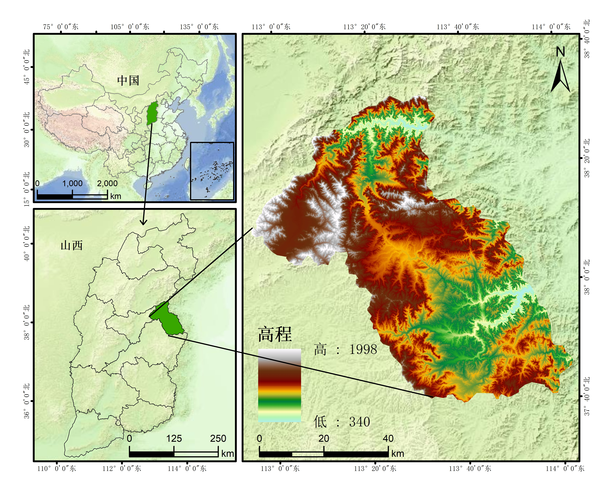
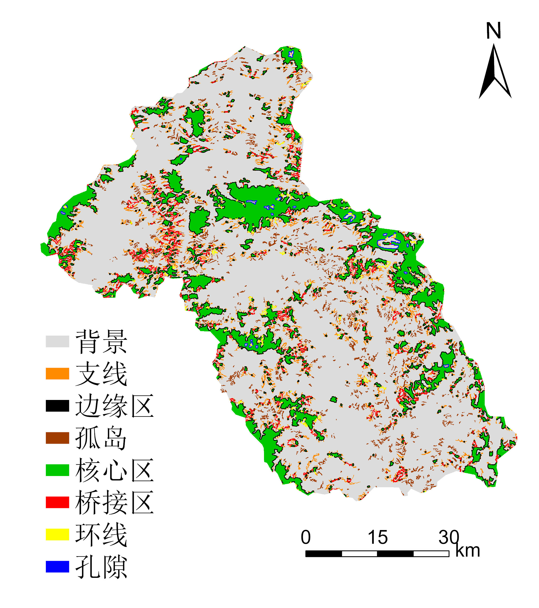
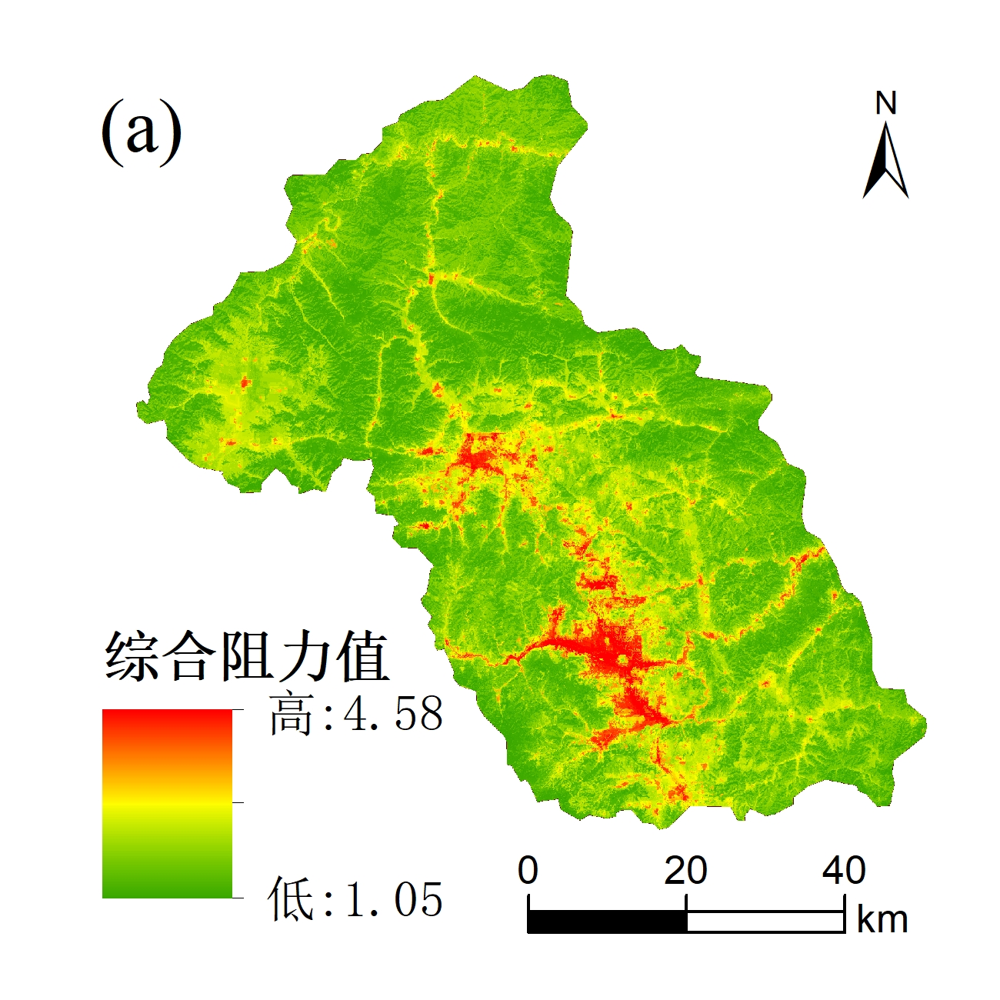
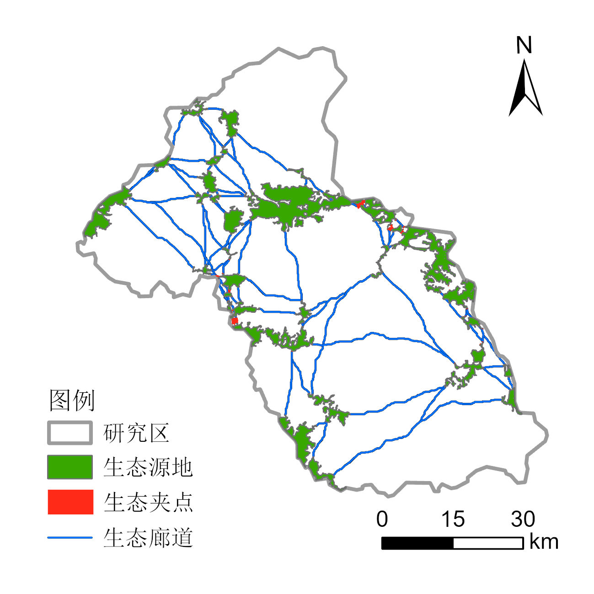
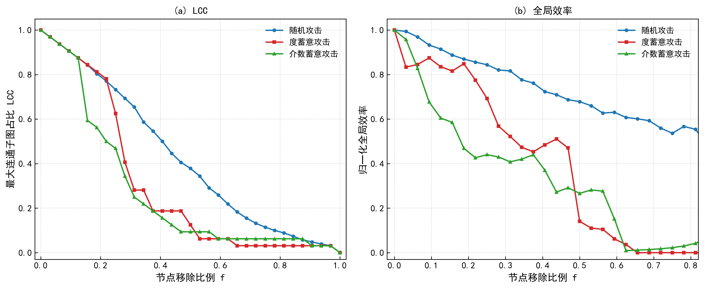
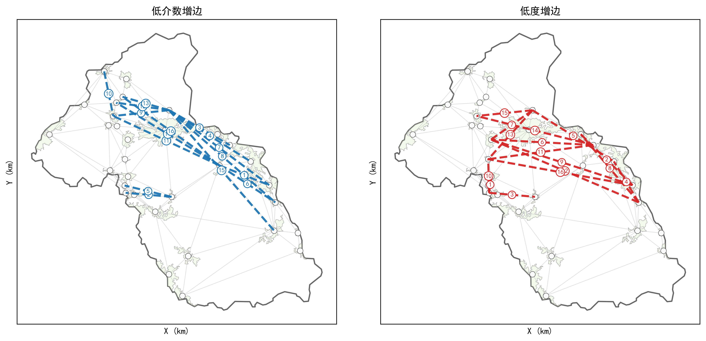
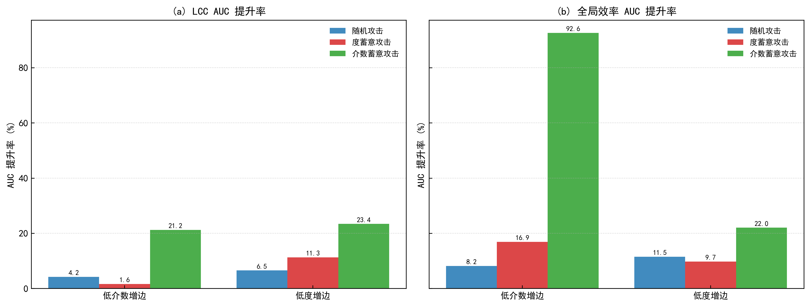
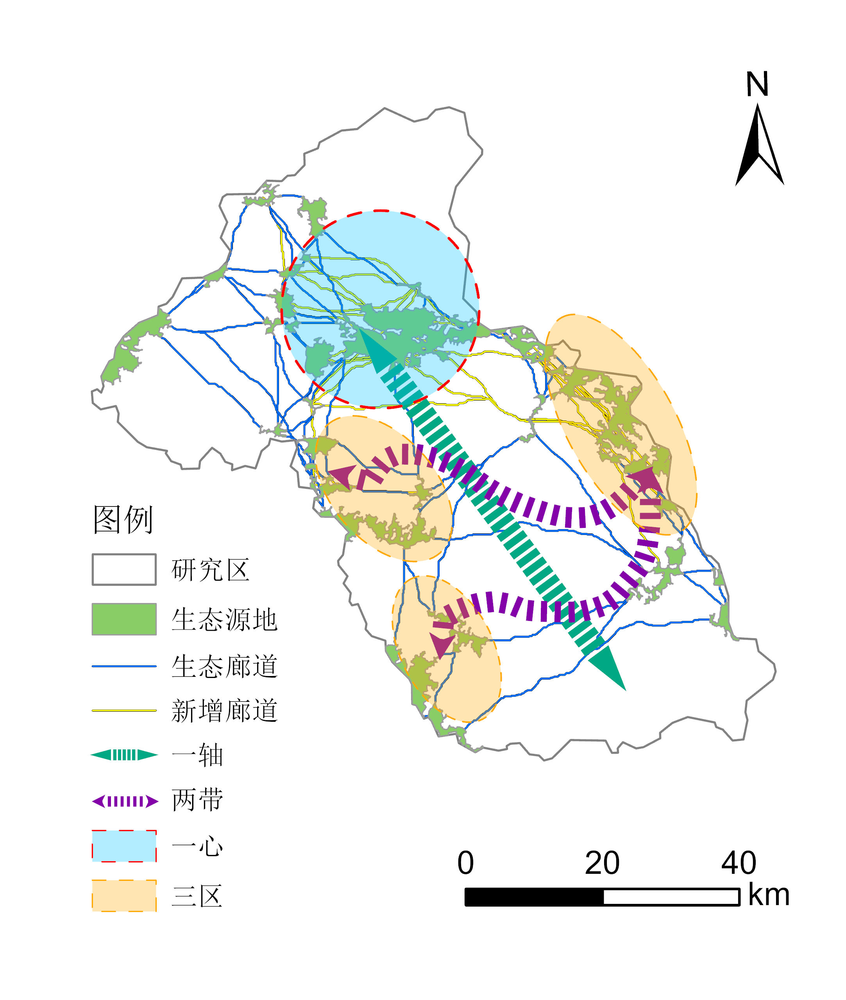

## 研究背景

城市扩张与基础设施建设让生态网络不断破碎化，「斑块—岛屿效应」阻断物种迁移、降低连通性。既有研究大多停留在静态的空间识别层面——源地在哪、廊道怎么连——但对网络建成后的**韧性和抗扰动能力缺乏量化评估**，优化策略也多基于定性排序而非定量验证。

本作品尝试构建「识别—评估—优化—规划」全链条定量框架：MSPA 与景观连通性评价识别源地 → AHP 阻力面 + 电路理论提取廊道与夹点 → 复杂网络攻击模拟量化韧性 → 定向增边优化并对比验证 → 生态安全格局规划方案。



研究区为山西省阳泉市（约 4559 km²），地处太行山中段西麓，山地丘陵占 80% 以上。作为煤炭资源型城市，长期采矿形成大面积采煤沉陷区与工矿废弃地，生态斑块碎片化明显，源地间连通性不足，是验证这一框架的典型场景。

## 生态源地识别

三步法：**MSPA 形态学分析**（Guidos Toolbox 3.3，八邻域、边缘宽度 5 像元，将林草等高生态价值用地分解为核心、边缘、桥接等结构要素）→ **景观连通性评价**（Conefor 计算 IIC/PC 指数）→ **面积筛选**（≥ 2 km²），最终识别出 **32 个生态源地**，总面积 421.89 km²，其中面积小于 5 km² 的斑块占 46.9%——以小斑块为主，空间上集中于西北部太行山山地和中部桃河流域，东南建成区稀疏。



## 阻力面与廊道提取

选取土地利用、NDVI、人口密度、夜间灯光、公路/铁路/水系距离、坡度、DEM 共 9 个阻力因子，AHP 定权（一致性比率 CR = 0.058 < 0.1）。土地利用权重最高（0.298），其次为 NDVI（0.163）、人口密度（0.161）、夜间灯光（0.135）。综合阻力面呈「西北低—中部高」格局：极低阻力区在西部林地水体，极高阻力区集中于建成区与采矿迹地。



廊道与夹点：Linkage Mapper 提取最小累积成本路径，Circuitscape 以 all-to-one 模式（距离阈值 1000 m）计算电流密度识别夹点。与最小成本路径「只给一条线」不同，电路理论同时考虑所有可能路径的并联效应，更贴近物种扩散的多路径选择。共提取 **82 条生态廊道**，整体「西北密—东南疏」。



## 网络韧性评估

把生态网络抽象为加权无向图 G=(V,E)：节点 = 源地斑块，边 = 廊道，边权 = 累积阻力距离（32 节点、82 边，NetworkX）。设计三种攻击策略模拟节点渐进失效：**随机攻击**（重复 50 次取均值，模拟自然扰动）、**度蓄意攻击**（每次移除度最大节点）、**介数蓄意攻击**（每次移除介数最高节点），以最大连通分量占比（LCC）与全局效率（GE）刻画结构与功能韧性，并用衰减曲线下面积（AUC）作综合度量。

攻击模拟与增边评估的核心代码（摘自作品的 `Tool3_网络韧性评价与增边优化.py`）：

```python
def simulate_attack(G_init, strategy, n0, weight='weight', seed=None):
    """逐节点移除，记录 LCC 占比与归一化全局效率的衰减曲线"""
    rng = np.random.default_rng(seed)
    G = G_init.copy()
    eff0 = weighted_global_efficiency(G, weight)          # 初始全局效率基准
    fracs, lccs, effs = [0.0], [lcc_ratio(G, n0)], [1.0]
    removed = 0
    while G.number_of_nodes() > 0:
        if strategy == 'random':                          # 随机攻击：随机选点
            target = rng.choice(list(G.nodes()))
        elif strategy == 'degree':                        # 度蓄意：移除当前度最大的点
            target = max(dict(G.degree()), key=dict(G.degree()).get)
        elif strategy == 'betweenness':                   # 介数蓄意：移除当前介数最高的点
            bcs = nx.betweenness_centrality(G, weight=weight)
            target = max(bcs, key=bcs.get)
        G.remove_node(target)
        removed += 1
        fracs.append(removed / n0)
        lccs.append(lcc_ratio(G, n0) if G.number_of_nodes() else 0.0)
        effs.append(weighted_global_efficiency(G, weight) / eff0
                    if G.number_of_nodes() else 0.0)
    return np.array(fracs), np.array(lccs), np.array(effs)
```



原始网络的韧性 AUC 对比很说明问题：随机攻击下 LCC 的 AUC 为 0.4276、全局效率 AUC 为 0.6751；度蓄意攻击分别降至 0.3027 和 0.3425；**介数蓄意攻击进一步降至 0.2715 和 0.2941**——网络对少数高中介性「桥节点」高度依赖，移除前几个关键节点即可造成连通性急剧下降。

## 定向增边优化

针对「边缘节点连接不足 + 关键节点中介压力过大」的结构性脆弱，设计两种增边策略：低度优先（LDF）与低介数优先（LBF）。增边遵循三条原则：① 按中心性升序，优先为中心性最低的薄弱节点建连；② 薄弱节点连接中心性 40%~80% 分位的中等节点，避免强化已有的攻击靶点；③ 新增边数不超过原边数的 20%，候选边最短路径距离 ≤ 70 km。

```python
def targeted_addition(G_init, add_ratio, d_max, metric):
    """定向增边：薄弱节点 × 中等分位节点，按网络距离取最近的 k 条"""
    G = G_init.copy()
    N, M = G.number_of_nodes(), G.number_of_edges()
    k_add  = int(round(M * add_ratio))          # 增边数量上限 = 原边数 × 20%
    n_weak = max(1, int(round(N * add_ratio)))  # 薄弱节点数

    centrality = compute_centrality(G, metric)  # 'degree' 或 'betweenness'
    sorted_nodes = sorted(centrality.items(), key=lambda x: x[1])
    weak_nodes = [n for n, _ in sorted_nodes[:n_weak]]            # 中心性最低的一批
    mid_nodes  = [n for n, _ in sorted_nodes[                      # 40%~80% 中等分位
        int(round(N * 0.40)):int(round(N * 0.80))]]

    sp = dict(nx.all_pairs_dijkstra_path_length(G, weight='weight'))
    candidates = [(u, v, sp[u][v]) for u in weak_nodes for v in mid_nodes
                  if u != v and not G.has_edge(u, v)
                  and np.isfinite(sp[u].get(v, np.inf)) and sp[u][v] <= d_max]
    candidates.sort(key=lambda x: x[2])                            # 网络距离就近排序
    for u, v, d in candidates[:k_add]:
        G.add_edge(u, v, weight=0.8 * d, added=True)               # 新边成本打 8 折
    return G
```



对增边后的网络重新跑三种攻击模拟，用 AUC 提升率对比：



- **低度增边（LDF）**在结构韧性（LCC）上平均提升 13.73%，优于低介数的 9.01%——更适合延缓拓扑瓦解；
- **低介数增边（LBF）**在功能韧性（全局效率）上提升高达 39.24%，远超低度的 14.42%——分散了集中于少数桥节点的流量，替代路径供给显著增加；
- 综合两项指标，**低介数增边综合得分 24.13% > 低度增边 14.07%**，整体更优。

结论很明确：对这类「依赖少数关键节点」的生态网络，**优先给低介数的薄弱节点补连接，比单纯补度更有效**。

## 生态安全格局规划

结合太行山地形骨架与桃河水系格局，最终提出「**一心一轴两带三片多廊**」布局：「一心」为西北太行山集中连片源区（划生态保育红线）；「一轴」为纵贯南北的温河—桃河生态主轴；「两带」为中部、南部沿河横向连通带；「三片」按源地聚类分为西部保育、西南连接、东部修复三片；「多廊」由现有廊道与新增优化廊道构成，新增廊道集中于中北部源地密集区填补短距离连通缺口。



## 成果工具化

整套流程封装为 ArcGIS Pro 的 Python 工具箱（`.pyt`，四个工具：因子数据预处理 → 多因子批量重分类 → 网络韧性评价与增边优化 → 增边廊道矢量化），拿到土地利用、DEM、NDVI、人口密度、夜间灯光、坡度栅格和公路/铁路/水系矢量后，按默认分级区间即可复跑，增边结果输出为矢量廊道和 `added_edges.csv` 节点表。

## 不足与展望

1. AHP 权重存在主观性，后续可用机器学习多模型交叉验证；
2. 尚未把采煤塌陷区、煤矸石堆积等矿业活动的空间影响显式纳入阻力面；
3. 廊道提取未考虑物种迁徙行为特征，后续可融合生态系统服务评估与多目标优化。
