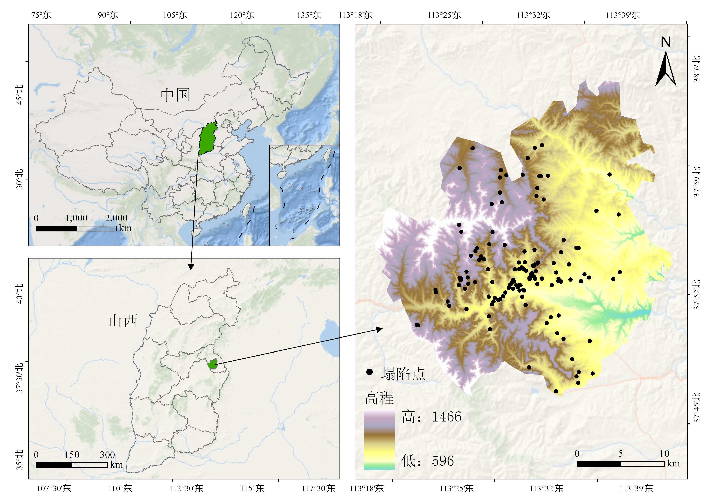
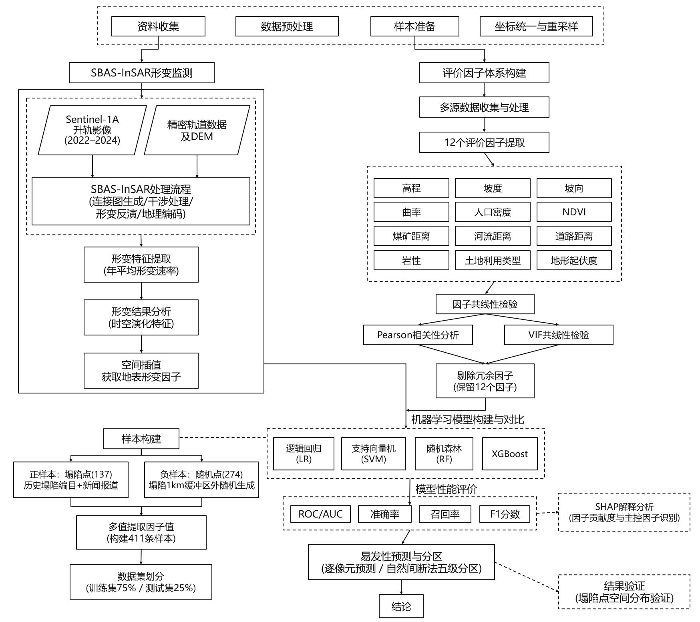
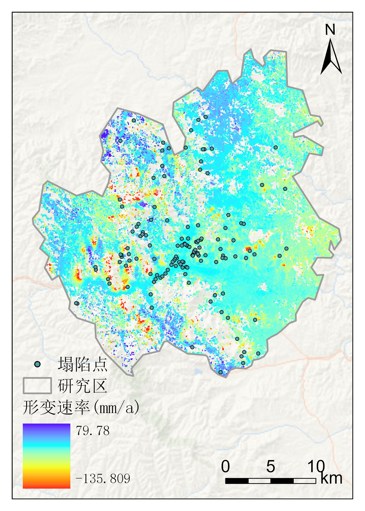
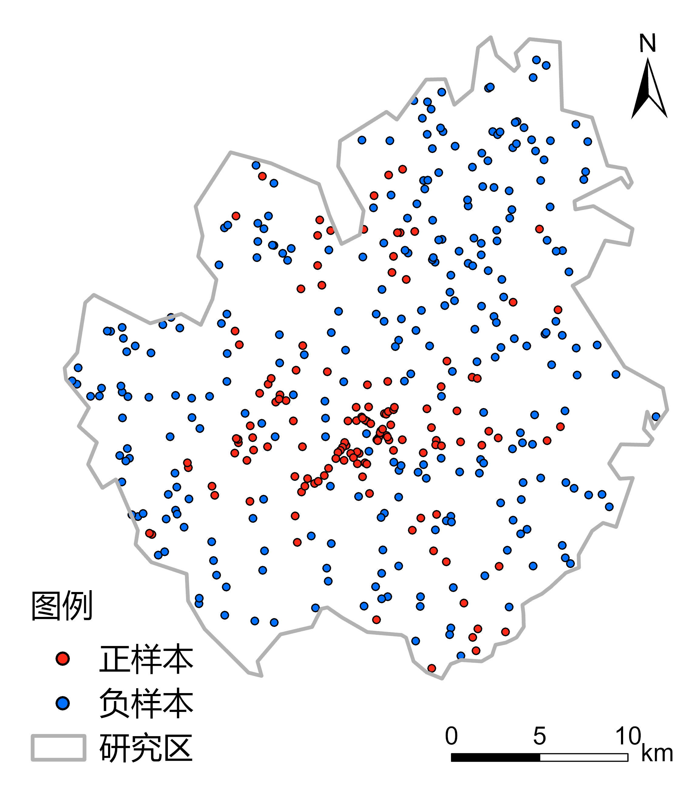
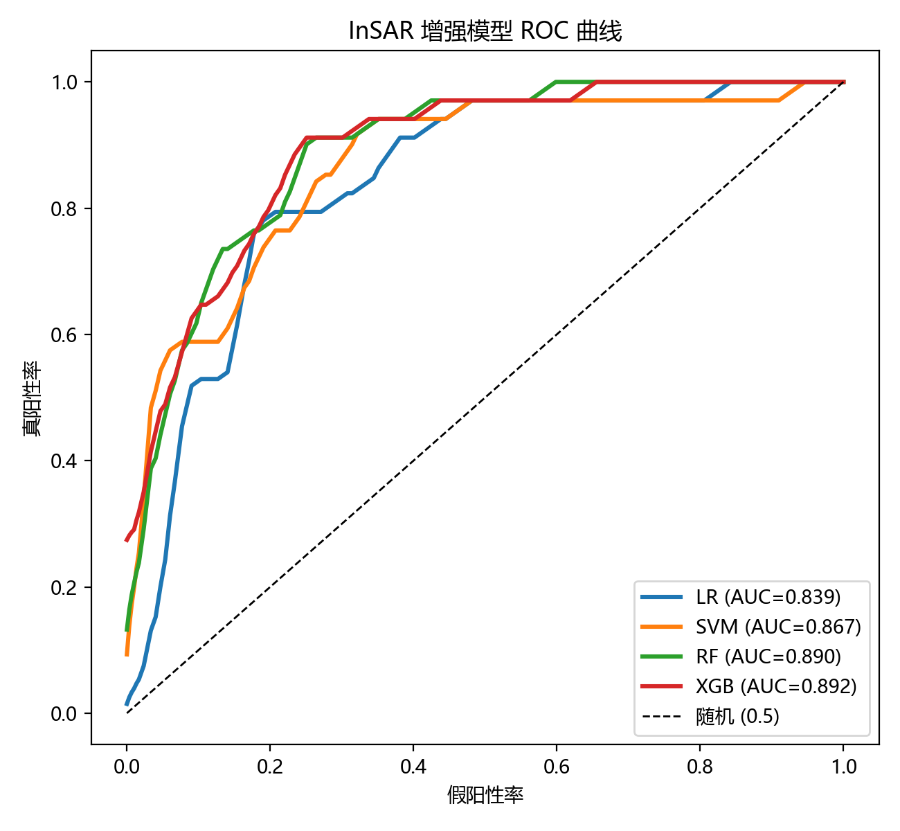
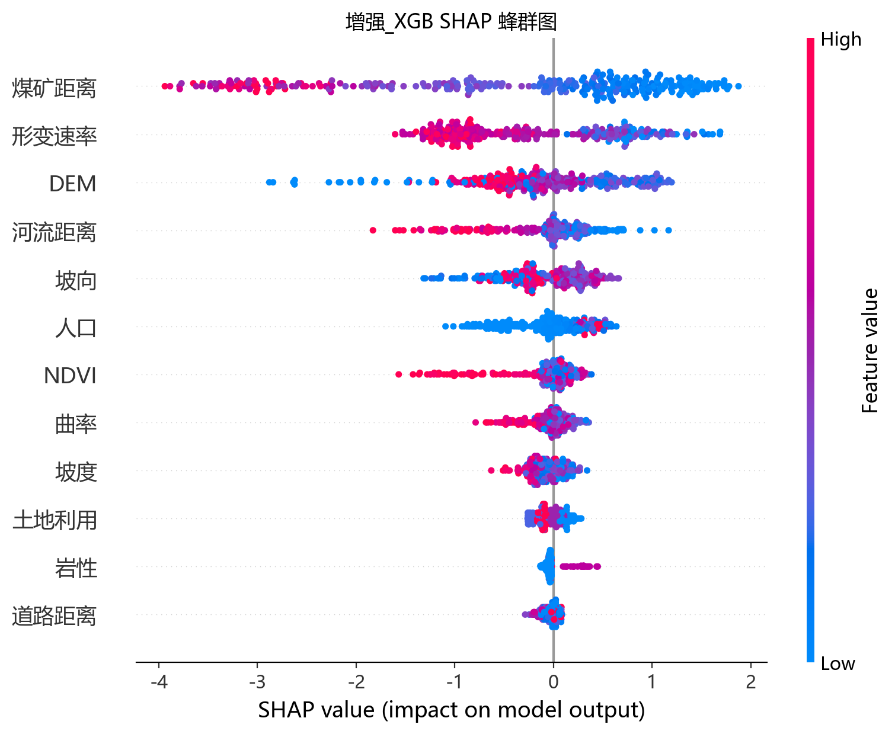
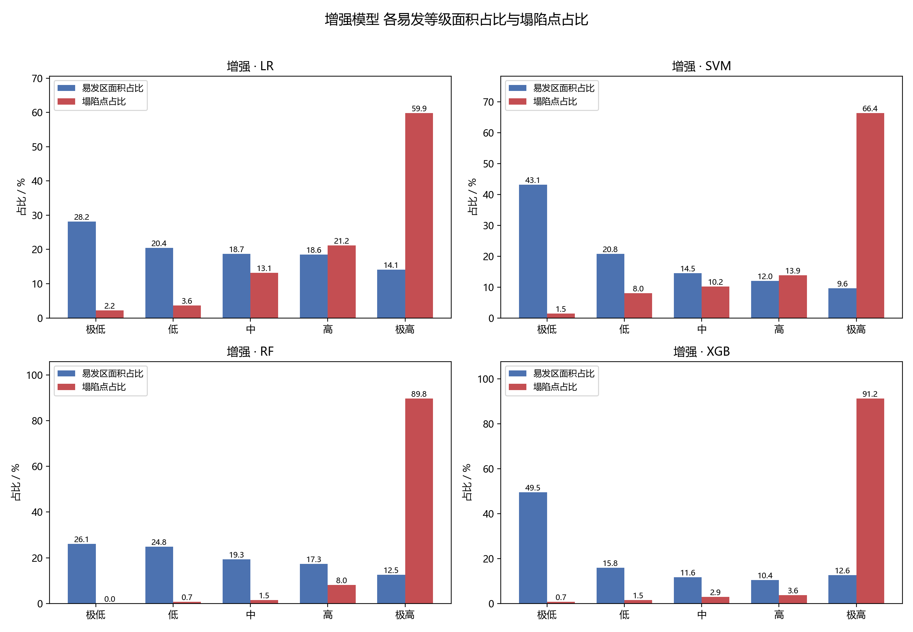
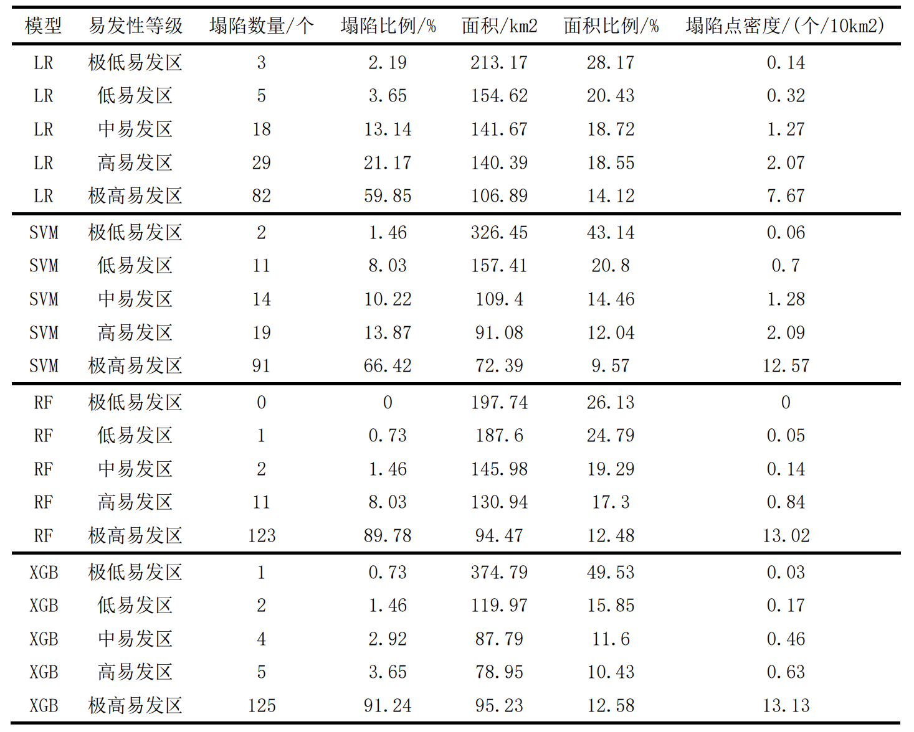

## 研究背景

我国是煤炭开采大国，长期大规模地下开采形成大面积采空区，引发的地面塌陷破坏村庄房屋、农田道路与地下管线，还常诱发地裂缝等伴生灾害。易发性评价是从「被动应对」转向「主动防控」的关键环节，但传统知识驱动方法（如层次分析法）权重主观性强，难以刻画致灾因子的非线性耦合；而单纯依靠形变监测又只能看到「正在塌」的地方，看不到「将要塌」的地方。

本作品的思路是：**时序 InSAR 测形变，可解释机器学习讲机制**——把 SBAS-InSAR 形变速率作为一个动态评价因子，与地形、地质、人类活动等静态因子融合建模，并通过基础模型（不含 InSAR）与增强模型（含 InSAR）的对照实验，定量回答「形变信息到底带来多少增益」。



研究区为阳泉市郊区（113°18′–113°42′E、37°46′–38°5′N，约 627 km²），地处太行山西麓，黄土丘陵地貌、沟壑纵横；区内含煤岩系广布，采空区连片发育，塌陷坑、塌陷槽广泛分布，是开展塌陷易发性评价的理想区域。

## 技术路线



| 环节 | 主要内容 | 工具 |
| --- | --- | --- |
| 数据获取 | Sentinel-1A 影像、DEM、多源因子数据 | ASF、SRTM、GEE、WorldPop、OSM |
| SBAS-InSAR 处理 | 连接图、干涉工作流、两次反演、地理编码 | SARscape 6.3（ENVI） |
| 因子构建 | 5 类 13 个因子 | ArcGIS Pro |
| 共线性检验 | Pearson 相关、VIF/TOL、标准化、独热编码 | Python（pandas / scikit-learn） |
| 样本构建 | 正负样本提取、缓冲区剔除、训练/测试划分 | ArcGIS Pro、Python |
| 建模对比 | LR / SVM / RF / XGBoost 基础与增强共 8 模型 | Python（scikit-learn、XGBoost） |
| 可解释性 | SHAP 因子贡献解析 | Python（SHAP） |
| 分区制图 | 全区域预测、自然间断法五级分区 | ArcGIS Pro |

## SBAS-InSAR 形变监测

选取 2022–2024 年共 24 景 Sentinel-1A 升轨影像，在 SARscape 中完成：连接图生成（24 景连接关系良好、无孤立影像）→ 干涉工作流（公共主影像配准、Goldstein 滤波、MCF 解缠、相干阈值 0.3）→ SVD 两次反演去大气相位 → 地理编码，输出逐像元视线向年平均形变速率（mm/a）。



反演结果（形变速率 RMSE 均值约 3.4 mm/a）显示：研究区大部分区域形变速率在 -4~1 mm/a，整体稳定；沉降区约占 20%，强沉降区（< -14 mm/a）约占 4%，呈漏斗状或条带状沿历史采空区展布，最大沉降速率达 -100 mm/a。沉降区与塌陷点叠加后空间对应关系良好，但仍有部分塌陷点位于形变小区——它们可能发生在观测时段之前、形变已趋稳定，这正说明**仅靠形变信息无法完整识别塌陷易发区，需要与静态因子联合建模**。

## 评价因子与样本

从地形地貌（高程、坡度、坡向、曲率、地形起伏度）、植被生态（NDVI）、人类活动（煤矿距离、河流距离、道路距离、人口密度）、地质条件（岩性、土地利用）、地表形变（SBAS-InSAR 形变速率）五个方面选取 13 个因子。Pearson 相关分析发现坡度与地形起伏度相关系数达 0.968，剔除后者后其余因子 VIF 均在 1.043–2.005 之间，最终保留 12 个因子。



样本构建：已核实塌陷点 137 处为正样本；以各点为中心建 1 km 缓冲区并剔除，避免负样本落入塌陷影响范围，再在剩余区域随机生成 274 个负样本（正负约 1:2），共 411 条样本，按 0.75:0.25 分层随机划分训练/测试集。

## 模型构建与精度对比

以不含 InSAR 的 11 个因子训练基础模型，加入形变速率的 12 个因子训练增强模型，各四种算法共 8 个模型。核心训练与评估逻辑（简化示意）：

```python
from sklearn.linear_model import LogisticRegression
from sklearn.svm import SVC
from sklearn.ensemble import RandomForestClassifier
from xgboost import XGBClassifier
from sklearn.metrics import roc_auc_score

models = {
    'LR': LogisticRegression(max_iter=2000),
    'SVM': SVC(probability=True),
    'RF': RandomForestClassifier(n_estimators=300),
    'XGB': XGBClassifier(n_estimators=300, eval_metric='logloss'),
}

# 基础因子（11 个）与增强因子（12 个，含 InSAR 形变速率）对照
for tag, X_tr, X_te in (('基础', X_base_tr, X_base_te),
                          ('增强', X_enh_tr, X_enh_te)):
    for name, clf in models.items():
        clf.fit(X_tr, y_tr)
        auc = roc_auc_score(y_te, clf.predict_proba(X_te)[:, 1])
        print(f'{tag}-{name}: AUC = {auc:.4f}')
```



| 模型 | 基础模型 AUC | 增强模型 AUC | 提升幅度 |
| --- | --- | --- | --- |
| LR | 0.7988 | 0.8393 | +0.0405 |
| SVM | 0.8180 | 0.8674 | +0.0494 |
| RF | 0.8423 | 0.8905 | +0.0482 |
| XGBoost | 0.8419 | **0.8917** | +0.0498 |

引入 InSAR 形变信息后，四个模型 AUC 平均提升约 0.047，其中增强 XGBoost 综合最优（准确率 0.806、召回率 0.824、F1 0.737）。

## SHAP 可解释性分析

对最优的增强 XGBoost 模型做 SHAP 解析：平均 |SHAP| 最大的是**煤矿距离（1.343）**，反映采动活动的主导控制作用；**形变速率次之（0.794）**，证明 InSAR 形变信息是识别塌陷活动的关键动态因子；其后依次为高程（0.573）、河流距离、坡向等。蜂群图进一步表明：距煤矿越近、沉降越强（形变速率越负）的样本塌陷概率越高，影响方向与塌陷发育机理一致。



## 易发性分区

用 8 个模型对全区域逐像元预测塌陷概率，自然间断法划分为极低、低、中、高、极高五级。增强 XGBoost 分区效果最佳：极低至中易发区合计约 77%，高与极高易发区合计约 23%，沿历史采空区呈条带状展布，与 InSAR 沉降异常区空间对应良好；塌陷点密度随等级严格递增（0.03 → 13.13 个/10 km²），**极高易发区集中了 91.24% 的塌陷点**。





## 结论与不足

1. SBAS-InSAR 反演表明沉降区约占研究区 20%，主要沿历史采空区分布，形变信息能有效指示塌陷活动区域；
2. 加入形变因子后四个模型 AUC 平均提升约 0.047，增强 XGBoost 最高（0.8917）；
3. SHAP 揭示煤矿距离与形变速率是两大主控因子，静态的「采动条件」与动态的「地表响应」缺一不可；
4. 五级分区中极高易发区集中了 91.24% 的塌陷点，可直接服务于矿区灾害巡查与监测预警布点。

不足之处：四种模型均为浅层模型，小样本下存在过拟合风险，后续可扩充样本并尝试深度学习；InSAR 结果尚未与地面实测（GNSS/水准）融合验证，计划在典型塌陷区布设监测点做交叉校正。
